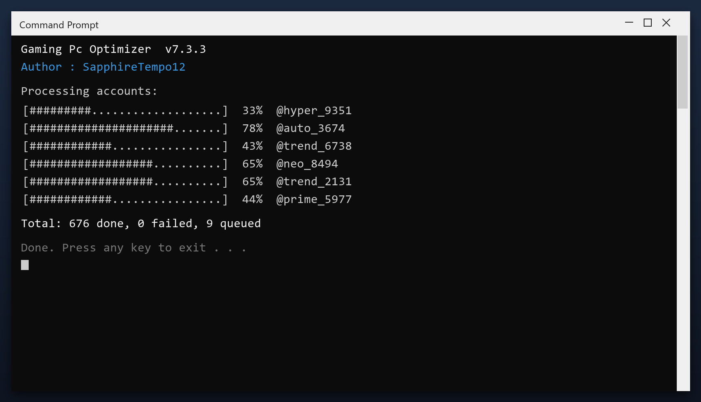

# Gaming Pc Optimizer — Free Download [2026]

 

Download gaming pc optimizer for free. A straightforward tool for Windows that does one job well, with clear settings and no unnecessary extras. **100% free. No account needed.**

| | |
| --- | --- |
| **Program** | Gaming Pc Optimizer |
| **Version** | Latest 2026 build |
| **Price** | Free |
| **Systems** | see requirements below |
| **Download** | Quick Start section below |

## Is this tool safe?

| **Problem** | **Solution** |
| --- | --- |
| **Slower every month** | Regular maintenance keeps it fast |
| **Slow shutdown** | Clear stuck background tasks |
| **High idle memory** | Trim memory-hungry apps |
| **Registry bloat** | Remove thousands of dead entries |
| **Messy files** | Find and remove duplicates |

## Does it really work?

- **Slower over time** - a PC never stays as fast as it was new
- **Long shutdowns** - Windows waits on stuck programs
- **High memory use** - idle apps keep eating RAM
- **Registry bloat** - thousands of dead entries
- **Messy downloads** - duplicate files everywhere

  

  

## How do I install it?

1. **Download** and unzip the package
2. **Right-click** the program and choose Run as administrator
3. **Choose a scan type** (quick or deep)
4. **Wait** for the report
5. **Select** the items to remove and confirm

> **Note:** make sure your work is saved before a deep clean. The tool creates a restore point, but saving first is always wise.

## What will I get?

| **Component** | **Details** |
| --- | --- |
| **Executable** | The tool itself |
| **Config** | Defaults already set |
| **Guide** | Plain-language walkthrough |
| **Support** | Issues section in this repo |

## What does it need?

| **Component** | **Requirement** |
| --- | --- |
| **Operating system** | Windows 10 or newer |
| **Processor** | Any x64 CPU |
| **Memory** | 2 GB or more |
| **Storage** | 100 MB free |
| **Display** | 1024x768 or higher |

## More questions

**Is gaming pc optimizer free?**

Yes - the full version, no registration and no hidden payments.

**Is it safe?**

The build is scanned and tested. It creates a restore point before making changes.

**Does it work on Windows 11?**

Yes, and on Windows 10 (64-bit).

**Will it delete my files?**

No. It only removes temporary and leftover files, not your documents or photos.

**Do I need the internet?**

Only to download it. After that it works offline.

**Where do I download it?**

Use the green button in the Quick Start section above.

## Notes

- Do not run two cleaners at the same time
- Use the preview to see what will be removed
- Keep the restore point until you are sure
- Re-scan after installing big programs
- Back up documents before any deep clean

---

*deft-shadow-225 · Updated 2026-10-10 · Shared under the MIT License*
